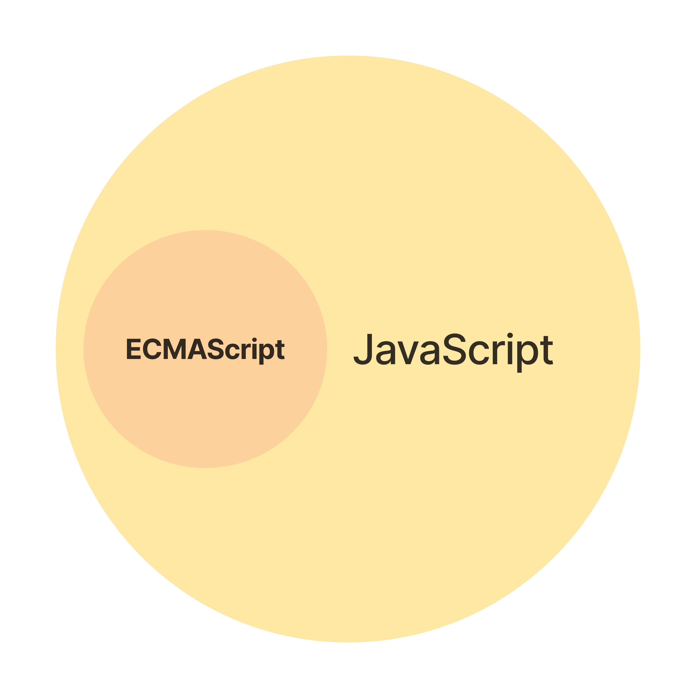

# 2장 자바스크립트란?

## 목차
- [자바스크립트의 탄생](#2.1)
- [자바스크립트의 표준화](#2.2)
- [자바스크립트 성장의 역사](#2.3)
- [자바스크립트와 ECMAScript](#2.4)
- [자바스크립트의 특징](#2.5)
- [ES6 브라우저 지원 현황](#2.6)

## 2.1 자바스크립트의 탄생
- 자바스크립트의 탄생 배경
  - 1995년, 웹페이지에서 보조적인 기능 수행하기 위해 브라우저에서 동작하는 경량 프로그래밍 언어 도입을 위해 만들어짐
- 자바스크립트의 이름 변천사
  - 1996년 3월, '모카'
  - 1996년 9월, '라이브스크립트'
  - 1996년 12월, '자바스크립트'

## 2.2 자바스크립트의 표준화
- 크로스 브라우징 이슈
  - 넷스케이프 커뮤니케이션즈의 JavaScript와 마이크로소프트의 JScript 경쟁으로 자사 브라우저에서만 동작하는 기능을 추가하여, 브라우저에 따라 웹페이지가 강상적으로 동작하지 않는 크로스 브라우징 이슈 발생
- ECMAScript
  - 자바스크립트의 파편화 방지 및 모든 브라우저에서 정상적으로 동작하는 표준화된 자바스크립트의 필요성으로 탄생
  - 1997년 7월, ECMAScript 1
    - 초판
  - 1998년, ECMAScript 2
    - ISO/IEC 16262 국제 표준과 동일한 규격 적용
  - 1999년, ECMAScript 3
    - 정규 표현식
    - try...catch
  - 2009년, ECMAScript 5(ES5) 
    - 표준 사양
    - JSON, strict mode, 접근자 프로퍼티, 프로퍼티 어트리뷰터 제어, 향상된 배열 조작 기능(forEach map, filter, reduce, some, every)
  - 2015년, ECMAScript 6(ECMAScript 2015, ES6)
    - let/const 키워드, 화살표 함수, 클래스, rest 파라미터, 심벌, 프로미스, Map/Set, 이터러블, for...of, 제너레이터, Proxy, 모듈 import/export

## 2.3 자바스크립트 성장의 역사
### 초창기
- 웹페이지의 보조적인 기능을 수행하기 위해 한정적인 용도로 사용
- 웹 서버에서 대부분의 로직 실행, 브라우저는 서버로부터 전달받은 HTML, CSS 렌더링

### 2.3.1 Ajax(XMLHttpRequest)
- 비동기 방식으로 데이터 교환
- 웹페이지에서 변경할 필요가 있는 부분만 서버로부터 필요한 데이터만 전송받아 한정적으로 렌더링
  - 데스크톱 애플리케이션과 유사한 빠른 성능과 부드러운 화면 전환 가능
  - 2005년, 구글 맵스

### 2.3.2 jQuery
- 2006년 등장
- DOM을 더욱 쉽게 제어 가능

### 2.3.3 V8 자바스크립트 엔진
- 2008년, 구글의 V8 자바스크립트 엔진
  - 데스크톱 애플리케이션과 유사한 사용자 경험(UX)을 제공할 수 있는 웹 애플리케이션 프로그래밍 언어로 정착하게 된 계기가 됨
- 웹 서버에서 수행되던 로직들이 대거 클라이언트로 이동

### 2.3.4 Node.js
- 2009년, 구글 V8 자바스크립트 엔진으로 빌드된 자바스크립트 런타임 환경
- 브라우저 이외의 환경에서도 동작할 수 있도록 자바스크립트 엔진을 브라우저에서 독립시킨 자바스크립트 실행 환경
  - 서버 사이드 애플리케이션 개발에 주로 사용됨
  - 모듈, 파일 시스템, HTTP 등 빌트인 API 제공
- 프론트엔드 영역뿐만 아니라 백엔드 영역에서도 자바스크립트를 사용할 수 있는 동형성 제공
- 비동기 I/O 지원, 단일 스레드 이벤트 루프 기반
  - 요청 처리 성능이 좋음
  - SPA에 적합
  - CPU 사용률이 높은 애플리케이션에는 권장 안함
- 범용 프로그래밍 언어가 되는 계기 마련해줌

### 2.3.5 SPA 프레임워크
- CBD(Component based development) 방법론 기반
  - Angular, React, Vue.js, Svelte 등

## 2.4 자바스크립트와 ECMAScript
- ECMAScript
  - 자바스크립트의 표준 사양 ECMA-262 뜻함
  - 핵심 문법 규정(프로그래밍 언어의 값, 타입, 객체와 프로퍼티, 함수, 표준 빌트인 객체 등)
  - 브라우저에 내장되는 자바스크립트 엔진 구현 시, 브라우저 제조사는 ECMAScript 사양을 준수하여 엔진 구현
- 자바스크립트
  - ECMAScript와 클라이언트 사이드 Web API를 아우르는 개념
    - DOM, BOM, Canvas, XMLHttpRequest, fetch, requestAnimationFrame, SVG, Web Storage, Web Component, Web Worker 등 
  

## 2.5 자바스크립트의 특징
- 웹 브라우저에서 동작하는 유일한 프로그래밍 언어
- 기본 문법은 C & Java 유사, 셀프는 프로토타입 기반 상속, 스캄은 일급 함수의 개념 차용
- 인터프리터 언어(별도의 컴파일 작업 수행 안함)
- 모던 자바스크립트 엔진
  - 인터프리터와 컴파일러의 장점을 결합하여 인터프리터의 단점을 해결함
  - 컴파일 단계에서 추가적인 시간이 필요함에도 빠르게 코드 실행 가능
  - 전통적인 컴파일러 언어처럼 명시적인 컴파일 단계를 거치지지 않음
  - 복잡한 과정을 거치며 일부 소스코드를 커마일하고 실행함
  - 런타임에 컴파일되며, 실행 파일이 생성되지 않고 인터프리터의 도움 없이 실행할 수 없음
    - 컴파일러와 인터프리터의 기술적 구분이 모호해져 가는 추세이지만, 자바스크립트를 위의 이유로 인해 컴파일러 언어라고는 할 수 없음
- 멀티 패러다임 프로그래밍 언어
  - 명령형, 함수형, 프로토타입 기반 객체지향 프로그래밍을 지원
- 프로토타입 기반의 객체지향 언어

## 2.6 ES6 브라우저 지원 현황
- 바벨과 같은 트랜스파일러
  - ES6 이상 사양으로 구현한 소스코드를 ES6을 지원하지 않는 브라우저에서 실행시키기 위해, 트랜스파일러를 이용하여 ES5 이하의 사양으로 다운그레이드함.