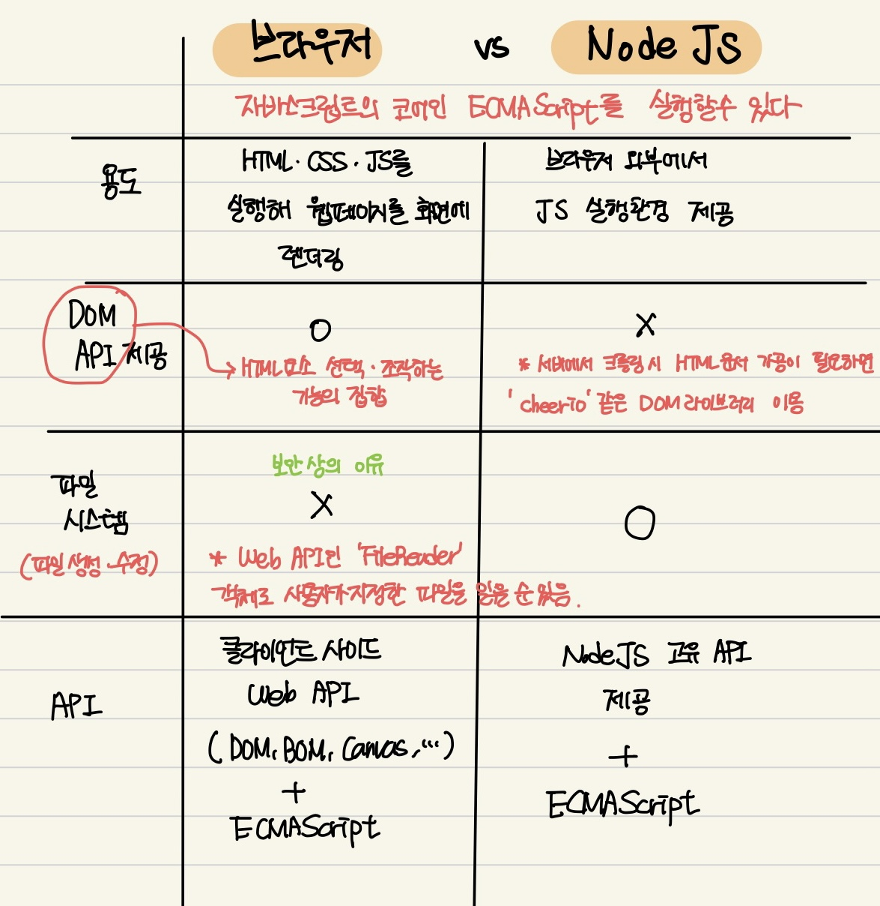

# 3장

# 3.1 자바스크립트 실행 환경

### 자바스크립트 실행 환경

- 모든 브라우저는 자바스크립트를 해석하고 실행할 수 있는 **자바스크립트 엔진**을 내장하고 있다.
- 자바스크립트는 **브라우저 환경** 또는 **Node.js 환경**에서 실행할 수 있다.

### 브라우저와 Node.js의 차이



# 3.2 웹 브라우저

- 이 책에서는 크롬 브라우저를 사용. (크롬 브라우저는 ECMAScript 사양을 준수하면서, 시장 점유율도 가장 높다.)

### 개발자 도구

- 브라우저에 기본 내장.
- **자주 쓰는 패널**
    - `Elements`
        - DOM, CSS편집해서 렌더링 된 뷰를 확인할 수 있다.
    - `Console`
        - 웹페이지의 에러나 Console.log 확인
    - `Sources`
        - 로딩된 자바스크립트 코드를 디버깅
    - `Network`
        - 로딩된 웹페이지와 관련된 **네트워크 정보와 성능 확인**
    - `Application`
        - 웹 스토리지, 세션, 쿠키

### 콘솔

- 자바스크립트 코드에서 에러가 발생했을 때 가장 우선적으로 살펴봐야할 곳
- 코드를 직접 입력해 그 결과를 확인할 수 있는 **REPL(Read Eval Print Loop)** 환경으로도 사용 가능.
- [https://developer.chrome.com/docs/devtools/](https://developer.chrome.com/docs/devtools/)

# 3.3 Node.js

프로젝트의규모가 커지면 Node.js와 npm이 필요하다.

### Node.js 와 Npm

[https://poiemaweb.com/nodejs-npm](https://poiemaweb.com/nodejs-npm)

- Node.js
    - **크롬 V8 자바스크립트 엔진으로 빌드된 자바스크립트 런타임 환경**
    - 브라우저에서만 동작하던 자바스크립트를 브라우저 외 환경에서 동작시킬 수 있는 JS 실행 환경.
- Npm
    - **자바스크립트 패키지 매니저.**
    - Node.js에서 사용할 수 있는 **모듈들을 패키지화해서 모아둔 저장소 역할**과, **패키지 설치 및 관리를 위한 CLI**(command line interface)를 제공한다.

### Node.js REPL

```jsx
$node

$node index.js //node + 파일명
```

으로 실행한다.

# VSC

- 추천 플러그인
    - Code Runner : 단축키를 통해 소스코드 간단히 실행
    - Live Server: 소스코드 수정 시마다 수정 사항을 브라우저에 자동 반영
