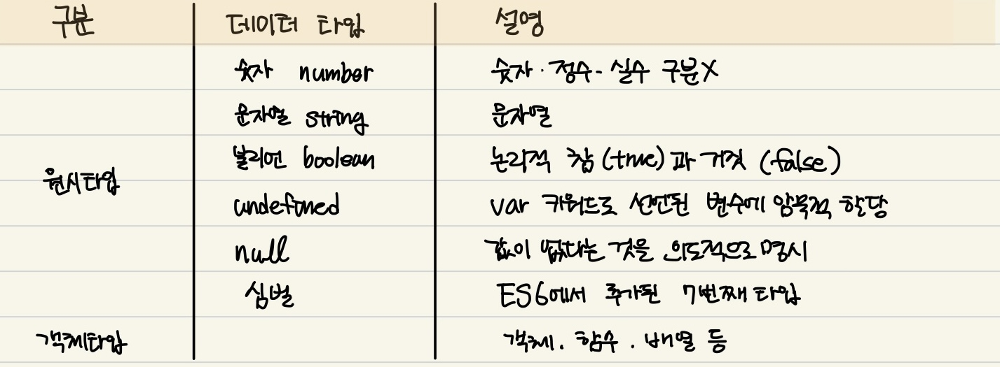

# 6장 데이터 타입

자바스크립트(ES6)는 7개의 데이터 타입을 제공한다. 7개의 데이터 타입은 `원시 타입`과 `객체 타입`으로 분류된다.



- 숫자 타입과 문자열 타입은 목적, 확보 해야 할 메모리 공간의 크기, 메모리에 저장되는 2진수도 다르며 읽어 들여 해석하는 방식도 다르다.
- 이처럼 개발자는 명확한 의도를 가지고 타입을 구별해서 값을 생성할 것이고, 자바스크립트 엔진은 타입을 구별해서 값을 취급할 것이다.

# 6.1 숫자 타입

- 자바스크립트는 독특하게 하나의 숫자 타입만 존재한다.
- 모든 수를 실수로 처리하며, 배정밀도 64비트 부동 소수점 형식을 따른다.
- 정수, 실수, 2진수, 8진수, 16진수 리터럴은 모두 **배정밀도 64비트 부동 소수점 형식의 2진수로 저장**된다. 자바스크립트는 2진수, 8진수, 16진수를 표현하기 위한 데이터 타입을 제공하지 않기 때문에 이들 값을 참조하면 모두 **10진수**로 해석된다.

  ```jsx
  var binary = 0b01000001; //2진수
  var octal = 0o101; //8진수
  var hex = 0x41; //16진수

  console.log(binary); //65
  console.log(octal); //65
  console.log(hex); //65
  console.log(binary === octal); //true
  console.log(hex === octal); //true
  ```

- 자바스크립트의 숫자 타입은 모든 수를 **실수**로 처리하기 때문에, 정수끼리 나눠도 실수가 나올 수 있다.
  ```jsx
  console.log(4 / 2); //2
  console.log(3 / 2); //1.5
  ```
- 숫자 타입은 추가적으로 세 가지 특별한 값도 표현할 수 있다.
  - `Infinity`: 양의 무한대
  - `-Infinity`: 음의 무한대
  - `NaN`: 산술 연산 불가
    ```jsx
    console.log(10 / 0); //Infinity
    console.log(10 / -0); //-Infinity
    console.log(1 * "String"); //NaN
    ```
    - 자바스크립트는 대소문자를 구별하므로 NAN, Nan, nan을 식별자로 해석한다.

# 6.2 문자열 타입

- 문자열은 0개 이상의 16비트 유니코드 문자(UTF-16)의 집합으로 전 세계 대부분의 문자를 표현할 수 있다.
- 문자열은 작은 따옴표(‘’), 큰 따옴표(“”), 또는 백틱(``) 으로 텍스트를 감싼다. 자바스크립트에서 가장 일반적인 표기법은 **작은 따옴표**를 사용하는 것이다.
- 문자열을 따옴표로 감싸지 않으면 자바스크립트 엔진은 키워드나 식별자 같은 토큰으로 인식한다. 또한, 공백 문자도 포함시킬 수 없다.

# 6.3 템플릿 리터럴

- 템플릿 리터럴은 1. `멀티라인 문자열`, 2. `표현식 삽입`, 3. `태그드 템플릿` 등 편리한 문자열 처리 기능을 제공한다. 템플릿 리터럴은 런타임에 일반 문자열로 변환되어 처리된다.

## 6.3.1 멀티라인 문자열

- 일반 문자열에서 줄바꿈 등의 공백을 표현하려면 백슬래시로 시작하는 `이스케이프 시퀀스`를 사용해야 한다.

<aside>
💡 **라인 피드와 캐리지 리턴**

개행 문자(택스트의 한 줄이 끝남을 표시하는 문자 또는 문자열)에는 `라인 피드`와 `캐리지 리턴`이 있다.

자바스크립트에서는 라인 피드와 캐리지 리턴 모두 개행을 의미하지만, 캐리지 리턴(\r)으로 개행하는 경우는 거의 없고 일반적으로 라인 피드(\n)를 사용해 개행한다.

</aside>

- 템플릿 리터럴 내에서는 이스케이프 시퀀스를 사용하지 않고도 줄바꿈이 허용되며, 모든 공백도 있는그 대로 적용한다.

## 6.3.2 표현식 삽입

- `+ 연산자`는 피연산자 중 하나 이상이 문자열인 경우 **문자열 연결 연산자**로 동작한다. 그 외에는 **덧셈 연산자**로 동작한다.
- 템플릿 리터럴 내에서는 표현식 삽입을 통해 간단히 문자열을 삽입할 수 있다. 이를 통해 문자열 연산자보다 **가독성 좋고 간편하게 문자열을 조합**할 수 있다.

  - 일반 문자열에서의 표현식 삽입은 문자열로 취급된다.

  ```jsx
  var first = "Ung-mo";
  var last = "Lee";

  console.log(`My name is ${first} ${last}.`); // My name is Ung-mo Lee.
  ```

# 6.4 불리언 타입

- 불리언 타입의 값은 true와 false뿐이다.

# 6.5 undefined 타입

- undefined 타입의 값은 undefined가 유일하다.
- var로 선언한 변수는 자바스크립트 엔진에 의해 암묵적으로 undefined로 초기화된다.
- 이처럼 undefined는 개발자가 의도적으로 할당하기 위한 값이 아니라 **자바스크립트 엔진이 변수를 초기화 할 때 사용하는 값이다.
  개발자가 변수에 의도적으로 undefined를 할당하면 본래 취지와 어긋날 뿐더러 혼란을 줄 수 있으므로 권장하지 않는다.** - 변수에 값이 없다는 걸 명시하고 싶을 때에는 null을 할당한다.

# 6.6 null 타입

- 자바스크립트는 대소문자를 구별하므로 null은 Null, NULL 등과 다르다.
- null은 변수에 값이 없다는 것을 의도적으로 명시할 때 사용한다. 이는 이전에 할당되어 있던 값에 대한 참조를 명시적으로 제거하는 것을 의미하며, 자바 스크립트 엔진은 누구도 참조하지 않는 메모리 공간에 대해 **가비지 콜렉션을 수행**할 것이다.
- 함수가 유효한 값을 반환할 수 없는 경우 명시적으로 null을 반환하기도 한다.
  - ex) document.querySelector

# 6.7 심벌 타입

- 변경 불가능한 원시 타입의 값.
- 다른 값과 중복되지 않는 유일무이한 값
- **이름이 충돌할 위험이 없는 유일한 프로퍼티 키를 만들기 위해 사용한다.**
- 다른 원시 값들은 리터럴을 통해 생성하지만 심벌은 Symbol 함수를 호출해 생성한다. **심벌 값은 외부에 노출되지 않으며, 다른 값과 절대 중복되지 않는 유일무이한 값이다.**

# 6.8 객체 타입

- 자바스크립트는 객체 기반의 언어이며, 자바스크립트를 이루고 있는 거의 모든 것이 객체이다.
- 지금까지 살펴본 6가지 데이터 타입 외의 값은 모두 객체 타입이다.

# 6.9 데이터 타입의 필요성

## 6.9.1 데이터 타입에 의한 메모리 공간의 확보와 참조

- 메모리에 값을 저장하려면 먼저 확보해야 할 메모리 공간의 크기를 결정해야 한다.
  ```jsx
  var score = 100;
  ```
  위 예제의 경우 자바스크립트 엔진은 리터럴 100을 숫자 타입의 값으로 해석하고 숫자 타입의 값 100을 저장하기 위해 **8바이트 메모리 공간**을 확보한다. 그리고 100을 **2진수**로 저장한다.
  값을 참조하는 경우, 식별자 score를 통해 숫자 타입의 값 100이 저장되어 있는 메모리 공간의 선두 메모리 셀의 주소로 찾아갈 수 있다.
  이때 값을 참조하려면 메모리 셀의 개수(바이트 수)를 알아야 한다. 자바스크립트 엔진은 score 변수를 숫자 타입으로 인식하고, 8바이트 단위로 메모리 공간에 저장된 값을 읽어 들인다.
    <aside>
    💡 **심벌 테이블**
    
    컴파일러 또는 인터프리터는 심벌 테이블이라고 부르는 자료 구조를 통해 식별자를 키로 바인딩 된 값의 메모리 주소, 데이터 타입, 스코프 등을 관리한다.
    
    </aside>

## 6.9.2 데이터 타입에 의한 값의 해석

- 메모리에 저장된 값은 데이터 타입에 따라 다르게 해석될 수 있다.
  - 0100 0011을 숫자로 해석하면 65지만 문자열로 해석하면 ‘A’이다.
  - score 변수에 할당된 값은 숫자 타입의 값이므로 메모리 공간의 주소에서 읽어 들인 2진수를 숫자로 해석한다.

### 데이터 타입이 필요한 이유

1. **값을 저장**할 때 확보해야 하는 **메모리 공간의 크기를 결정**하기 위해
2. **값을 참조**할 때 한 번에 읽어 들여야 할 **메모리 공간의 크기**를 결정하기 위해
3. 메모리에서 읽어 들인 **2진수를 어떻게 해석**할지 결정하기 위해

# 6.10 동적 타이핑

## 6.10.1 동적 타입 언어와 정적 타입 언어

- 정적 타입 언어
  - ex) C, 자바
  - **명시적 타입 선언** : 변수를 선언할 때 데이터 타입을 사전에 선언해야 한다.
  - **컴파일 시점에 타입 체크**를 한다. 타입 체크를 통과하지 못하면 에러를 발생 시킨다.
- 동적 타입 언어
  - ex) 자바스크립트, 파이썬, PHP, 루비, 리스프, 펄
  - 어떤 데이터 타입의 값이라도 자유롭게 할당할 수 있다.
  - 값을 할당하는 시점에 변수의 타입이 동적으로 결정되고 변수의 타입을 언제든지 자유롭게 변경할 수 있다.
  - **타입 추론** : 선언이 아닌 할당에 의해 타입이 결정된다. 재할당에 의해 변수의 타입은 언제든지 동적으로 변할 수 있다.

## 6.10.2 동적 타입 언어와 변수

- **동적 타입 언어는 유연성은 높지만 신뢰성은 떨어진다.**
- 이런 이유로 변수를 사용하기 이전에 데이터 타입을 체크해야 하는 경우가 있는데 이는 매우 번거로울 뿐더러 코드의 양도 증가한다.

### 변수 사용 시 주의할 사항

- 변수는 필요한 경우에만 제한적으로 사용한다.
- 변수의 스코프는 최대한 좁게 만들어 변수의 부작용을 억제한다.
- 전역 변수는 최대한 사용하지 않는다.
- 변수보다는 상수를 사용해 값의 변경을 억제한다.
- 변수 이름은 변수의 목적이나 의미를 파악할 수 있도록 네이밍한다.

- 코드는 오해하지 않도록 작성해야 한다. 사람이 이해할 수 있는 코드, **즉 가독성이 좋은 코드가 좋은 코드다.**
