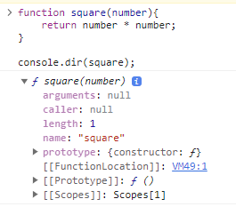
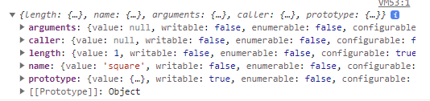
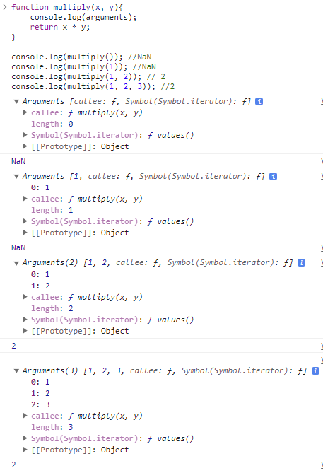

# 18장 함수와 일급 객체

# 18.1 일급 객체

- 일급 객체는 다음과 같은 조건을 만족한다.
  1. **무명의 리터럴**로 생성할 수 있다. 즉, **런타임에 생성**이 가능하다.
  2. **변수나 자료구조에 저장**할 수 있다.
  3. **함수의 매개변수**에 전달할 수 있다.
  4. **함수의 반환값**으로 사용할 수 있다.
- 자바스크립트 함수의 일급 객체로서의 특징
  - 자바스크립트의 함수는 **일급 객체**다. 즉, 함수를 객체와 동일하게 사용할 수 있다.
    **값**과 동일하게 취급될 수 있고, 값을 사용할 수 있는 곳이라면 어디든지 리터럴로 정의할 수 있으며, **런타임**에 함수 객체로 평가된다.
  - 일급 객체로서 함수가 가지는 가장 큰 특징은 일반 객체와 같이 **함수의 매개변수에 전달**할 수 있으며, **반환값**으로 사용할 수 있다는 것이다.
    ⇒ **함수형 프로그래밍**을 가능케 하는 자바스크립트의 장점이다.
- 일반 객체와의 차이점
  - 일반 객체는 호출할 수 없지만 함수 객체는 호출할 수 있다.
  - 함수 객체는 일반 객체에는 없는 함수 고유의 프로퍼티를 소유한다.

# 18.2 함수 객체의 프로퍼티

- 함수도 객체이기 때문에 프로퍼티를 가질 수 있다.

```jsx
function square(number) {
  return number * number;
}

console.dir(square);
```

  

- Object.getOwnPropertyDescriptors 메서드로 확인해보면 다음과 같다.

```jsx
console.log(Object.getOwnPropertyDescriptors(square));
```

  

- `arguments`, `caller`, `length`, `name`, `prototype` 프로퍼티는 모두 함수 객체의 데이터 프로퍼티이다.
- `__proto__` 는 접근자 프로퍼티이며, 함수 객체의 고유 프로퍼티가 아니라 Object.prototype 객체의 프로퍼티를 상속 받은 것이다.

## 18.2.1 arguments 프로퍼티

- 함수 객체의 arguments 프로퍼티 값은 arguments 객체다.
- arguments 객체는 함수 호출 시 전달된 **인수들의 정보**를 담고 있는 **순회 가능한 유사 배열 객체**다.
- 함수 내부에서 지역변수처럼 사용된다. 즉, 외부에서는 참조할 수 없다.
- 자바스크립트의 함수는 매개변수와 인수의 개수가 일치하는지 확인하지 않는다.

  - 매개변수 개수 > 인수 개수 : 전달되지 않은 매개변수는 undefined로 초기화된 상태를 유지한다.
  - 매개변수 개수 < 인수 개수 : 초과된 인수는 무시된다. 그렇지만 암묵적으로 arguments 객체의 프로퍼티로 보관된다.

  ```jsx
  function multiply(x, y) {
    console.log(arguments);
    return x * y;
  }

  console.log(multiply()); //NaN
  console.log(multiply(1)); //NaN
  console.log(multiply(1, 2)); // 2
  console.log(multiply(1, 2, 3)); //2
  ```

  
  `arguments`의 객체는 인수를 프로퍼티 값으로 소유하며, 프로퍼티 키는 **`인수의 순서`**를 나타낸다.
  `callee` 프로퍼티는 함수 자신을 가리키고, `length` 프로퍼티는 인수의 개수를 가리킨다.

- arguments 객체는 매개변수의 개수를 확정할 수 없는 `**가변 인자 함수**`를 구현할 때 유용하다.

  ```jsx
  function sum() {
  	let sum = 0;

  	for(let i = 0 ; i < **arguments**.length ; i++){
  		res += **arguments**[i];
  	}
  	return res;
  }
  ```

- arguments 객체는 실제 배열이 아닌 유사 배열 객체다. `유사 배열 객체`란 **length** 프로퍼티를 가진 객체로, **for문으로 순회**할 수 있는 객체를 말한다.

  - 유사 배열 객체에 배열 메서드를 사용하면 에러가 발생한다. 따라서 배열 메서드를 사용하려면 Function.prototpye.call, Function,prototype.apply 를 통해 간접 호출 해야하는 번거로움이 있다.

    ```jsx
    function sum() {
      const array = Array.prototype.slice.call(arguments);

      return (array = array.reduce(function (pre, cur) {
        return pre + cur;
      }, 0));
    }
    ```

  - 이런 번거로움을 해결하기 위해 ES6에서는 **Rest 파라미터**를 도입했다.
    ```jsx
    function sum(...args) {
      return args.reduce(function (pre, cur) {
        return pre + cur;
      }, 0);
    }
    ```
    rest 파라미터의 도입으로 모던 자바스크립트에서는 arguments 객체의 중요성이 이전 같지는 않지만 언제나 ES6만 사용하지는 않을 수 있기 때문에 알아둘 필요가 있다.

## 18.2.2 caller 프로퍼티

- caller프로퍼티는 ECMAScript 사양에 포함되지 않은 비표준 프로퍼티이고, 표준화 될 예정도 없는 프로퍼티 이므로 **사용하지 말고** 참고로만 알아둔다.
- caller 프로퍼티는 함수 자신을 호출한 함수를 가리킨다.

```jsx
function foo(func) {
  return func();
}

function bar() {
  return "caller : " + bar.caller;
}

console.log(foo(bar)); // caller: function foo(func) {...}
console.log(bar()); // caller: null
```

## 18.2.3 length 프로퍼티

- 함수를 정의할 때 선언한 매개변수의 개수를 가리킨다.
- **arguments객체의 length 프로퍼티**와 **함수 객체의 length 프로퍼티**의 값은 다를 수 있으므로 주의해야 한다.
  - **arguments의 length**: 인자의 개수
  - **함수 객체의 length**: 매개변수의 개수

## 18.2.4 name 프로퍼티

- 함수 객체의 name 프로퍼티는 함수 이름을 나타낸다.
- ES6에서 정식 표준이 되었다.
- name 프로퍼티는 ES5과 ES6에서 동작을 달리하므로 주의한다.

  - 익명 함수의 경우 ES5에서는 빈 문자열을 값으로 갖지만, ES6에서는 함수 객체를 가리키는 **식별자**를 값으로 갖는다.

  ```jsx
  // 기명 함수 표현식
  var namedFunc = function foo() {};
  console.log(named.name); //foo

  // 익명 함수 표현식
  var anonymousFunc = function () {};
  console.log(anonymousFunc.name); //anonymousFunc

  // 함수 선언문
  function bar() {}
  console.log(bar.name); //bar
  ```

  **함수 이름**과 **함수 객체를 가리키는 식별자**는 의미가 다르다는 것을 잊지 말자.
  함수를 호출할 때는 함수 이름이 아닌 함수 객체를 가리키는 **식별자**로 호출한다.

## 18.2.5 **\*\*proto**\*\* 접근자 프로퍼티

- 모든 객체는 [[Prototype]]이라는 내부 슬롯을 갖는다. [[Prototype]] 내부 슬롯은 객체지향 프로그래밍의 상속을 구현하는 프로토타입 객체를 가리킨다.
- **proto** 프로퍼티는 [[Prototype]] **내부 슬롯**이 가리키는 프로토타입 객체에 접근하기 위해 사용하는 접근자 프로퍼티다.
  내부 슬롯은 직접 접근할 수 없고, 간접적으로 접근 방법을 제공할 때에만 접근할 수 있다.

```jsx
const obj = { a: 1 };

console.log(obj.__proto__ === Object.prototype); //true

console.log(obj.hasOwnProperty("a")); //true
console.log(obj.hasOwnProperty("__proto__")); //false
```

## 18.2.6 prototype 프로퍼티

- prototype 프로퍼티는 생성자 함수로 호출될 수 있는 함수 객체, 즉 `constructor`만이 소유하는 프로퍼티다.
- 일반 객체와 생성자 함수로 호출할 수 없는 `non-constructor`에는 prototype 프로퍼티가 없다.

```jsx
(function () {}).hasOwnProperty("prototype"); //true
({}).hasOwnProperty("prototype"); //false
```
