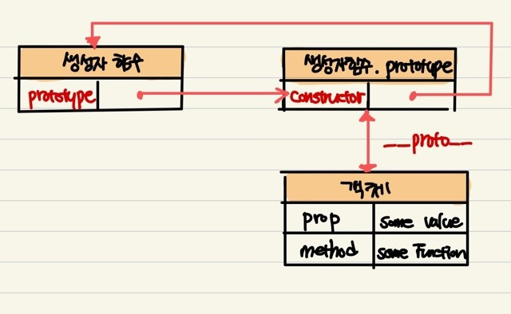
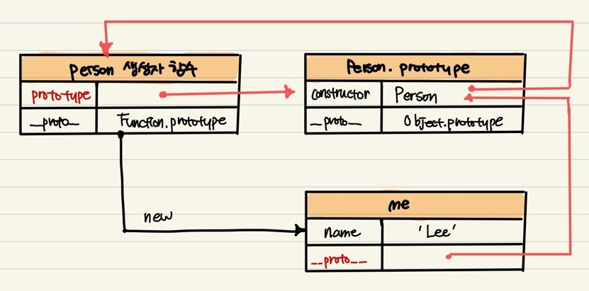

## 19.3 프로토타입 객체

- 프로토타입 객체는 **객체 간 상속**을 구현하기 위해 사용한다.
- 모든 객체는 [[Prototype]]이라는 내부 슬롯을 가지며, 이 내부 슬롯의 값은 프로토타입의 참조다.
- [[Prototype]]에 저장되는 프로토타입은 **객체 생성 방식**에 의해 결정된다. 즉, 객체가 생성될 때 객체 생성 방식에 따라 프로토타입이 결정되고 [[Prototype]]에 저장된다.
- **모든 객체는 하나의 프로토타입을 갖는다.** 그리고 모든 프로토타입은 생성자 함수와 연결되어 있다.
  - [[Prototype]] 내부 슬롯에 직접 접근할 수 없지만, **proto접근자 프로퍼티**를 통해 간접적으로 접근할 수 있다. 프로토타입은 **constructor 프로퍼티**를 통해 생성자 함수에 접근할 수 있고, 생성자 함수는 자신의 **prototype 프로퍼티**를 통해 프로토타입에 접근할 수 있다.
    

### 19.3.1 **proto** 접근자 프로퍼티

- 모든 객체는 **proto** 접근자 프로퍼티를 통해 자신의 프로토타입, 즉 [[Prototype]] 내부 슬롯에 간접적으로 접근할 수 있다.

### **proto**는 접근자 프로퍼티다.

- **내부슬롯은 프로퍼티가 아니다. (ref. 16.1)** 자바스크립트는 원칙적으로 내부 슬롯과 내부 메서드에 직접적으로 접근하거나 호출할 수 있는 방법을 제공하지 않는다.
  - 일부 내부 슬롯과 내부 메서드에 한하여 간접적으로 접근할 수 있는 수단을 제공한다.
  - [[Prototype]] 내부 슬롯에도 **직접 접근할 수 없으며**, \***\*proto**접근자 프로퍼티를 통해\*\* 간접적으로 [[Prototype]] 내부 슬롯의 값, 프로토타입에 접근할 수 있다.
- **`접근자 프로퍼티 (ref. 16.2)`**는 **[[Value]] 프로퍼티를 갖지 않고**, 다른 데이터 프로퍼티의 값을 읽거나 저장할 때 사용하는 **접근자 함수 ([[Get]], [[Set]])프로퍼티로 구성된 프로퍼티**다.

  - **proto** 를 통해 프로토 타입에 접근하면 [[Get]]이 호출되고, **proto**를 통해 새로운 프로토타입을 할당하면 [[Set]]이 호출된다.

  ```jsx
  const obj = {};
  const parent = { x: 1 };

  //getter함수인 get __proto__가 호출되어 obj 객체의 프로토타입을 취득
  obj.__proto__;

  //setter함수인 set __proto__가 호출되어 obj 객체의 프로토타입을 교체
  obj.__proto = parent;
  ```

### **proto**접근자 프로퍼티는 상속을 통해 사용된다.

- \***\*proto**접근자 프로퍼티는 객체가 직접 소유하는 프로퍼티가 아니라\*\* Object.pototype의 프로퍼티다.

```jsx
console.log({}.hasOwnProperty("__proto__")); //false
console.log({}.__proto__ === Object.prototype); //true
```

- \*Object.prototype
  - 자바스크립트 엔진은 객체의 프로퍼티에 접근하려고 할 때 해당 객체에 접근하려는 프로퍼티가 없다면 **proto**접근자 프로퍼티가 가리키는 참조를 따라 자신의 부모 역할을 하는 프로토타입의 프로퍼티를 **순차적으로 검색**한다. **(ref.19.7 프로토타입 체인)**
  - 프로토타입 체인의 최상위 객체는 Object.prototype이다.

### **proto** 접근자 프로퍼티를 통해 프로토타입에 접근하는 이유

**상호참조에 의해 프로토타입 체인이 생성되는 것을 방지하기 위해서다.**

```jsx
const parent = {};
const child = {};

child.__proto__ = parent;
parent.__proto__ = child; //TypeError: Cyclic __proto__ value
```

- 프로토 타입은 **단방향 링크드 리스트**로 구현되어야한다. 순환 참조하는 프로토타입 체인이 만들어지면 프로토타입을 검색할 때 무한 루프에 빠진다.
- 아무로 체크 없이 무조건적으로 프로토타입을 교체할 수 없도록 **proto** 접근자 프로퍼티를 통해 프로토타입에 접근하고 교체하도록 구현되어있다.

### **proto**접근자 프로퍼티를 코드 내에서 직접 사용하는 것은 권장하지 않는다.

- **proto**접근자 프로퍼티를 코드 내에서 직접 사용하는 것은 권장하지 않는다.

  - **proto** 접근자 프로퍼티를 사용할 수 없는 경우가 있다.

    - **직접 상속**을 통해 Object.prototype을 상속받지 않는 객체를 생성할 수도 있다.

    ```jsx
    // obj는 프로토타입 체인의 종점이다. 따라서 Object.__proto__를 상속받을 수 없다.
    const obj = Object.create(null);

    // obj는 Object.__proto__를 상속받을 수 없다.
    console.log(obj.__proto__); //null

    console.log(Object.getPrototypeOf(obj)); //null
    ```

  - **Object.getPrototypeOf** 메서드와 **Object.setPrototypeOf** 메서드를 사용할 것을 권장한다.

### 19.3.2 함수 객체의 prototype 프로퍼티

- **constructor**인 함수 객체만이 소유하는 prototype 프로퍼티는 생성자 함수가 생성할 인스턴스의 프로토타입을 가리킨다.
  - - **non-constructor**: 화살표 함수, ES6 메서드 축약표현

```jsx
(function () {}).hasOwnProperty('prototype'); //true
{}.hasOwnProperty('prototype'); //false
```

- 모든 객체가 갖고 있는(Object.prototype으로부터 상속받은) **proto**접근자 프로퍼티와 함수 객체만이 갖고 있는 prototype 프로퍼티는 **결국 동일한 프로토타입을 가리킨다.** 하지만 이들 프로퍼티를 사용하는 **주체**가 다르다.

| 구분                      | 소유        | 값                | 사용 주체   | 사용 목적                                                                    |
| ------------------------- | ----------- | ----------------- | ----------- | ---------------------------------------------------------------------------- |
| **proto** 접근자 프로퍼티 | 모든 객체   | 프로토타입의 참조 | 모든 객체   | 객체가 자신의 프로토타입에 접근 또는 교체하기 위해 사용                      |
| prototype 프로퍼티        | constructor | 프로토타입의 참조 | 생성자 함수 | 생성자 함수가 자신이 생성할 객체(인스턴스)의 프로토타입을 할당하기 위해 사용 |

```jsx
function Person(name) {
  this.name = name;
}

const me = new Person("Lee");
console.log(Person.prototype === me.__proto__); //true
```



### 19.3.3 프로토타입의 constructor 프로퍼티와 생성자 함수

- 모든 프로토타입은 constructor 프로퍼티를 갖는다.
  이 constructor 프로퍼티는 prototype 프로퍼티로 자신을 참조하고 있는 생성자 함수를 가리킨다.
  이 연결은 생성자 함수가 생성될 때, 즉 함수 객체가 생성될 때 이뤄진다.

```jsx
function Person(name) {
  this.name = name;
}

const me = new Person("Lee");
console.log(me.constructor === Person); //true
```

- me 객체에는 constructor 프로퍼티가 없지만 me 객체의 프로토타입인 Person.prototype에는 constructor 프로퍼티가 있다. **me 객체는 프로토타입인 Person.prototype의 constructor 프로퍼티를 상속받아 사용할 수 있다.**
