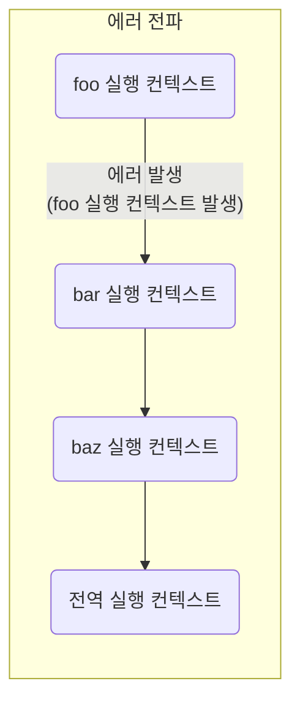

# 47장 에러 처리


## 목차

- [47.1 에러 처리의 필요성](#47.1)
- [47.2 try... catch... finally 문](#47.2)
- [47.3 Error 객체](#47.3)
- [47.4 throw 문](#47.4)
- [47.5 에러의 전파](#47.5)


## 47.1 에러 처리의 필요성<a name="47.1"></a>

- `try ... catch` 문을 사용해 발생한 에러에 적절하게 대응하면 프로그램이 강제 종료되지 않고 계속해서 코드 실행 가능

```js
console.log('[Start]');
foo(); // ReferenceError

console.log('[End]'); // 에러로 인해 해당 코드 실행 안됨
```

```js
console.log('[Start]');

try {
  foo();
} catch (error) {
  console.error('[에러 발생]', error); // [에러 발생] ReferenceError
}

console.log('[End]');
```

- 단축 평가 또는 옵셔널 체이닝 연산자 `?.` 사용하지 않으면 에러로 이어질 수 있음

```js
const $button = document.querySelector('button'); // null 
$button?.classList.add('disabled');
```


## 47.2 try ... catch .. finally 문<a name="47.2"></a>

- `try ... catch ... finally` 문을 실행하면 먼저 `try` 코드 블록 실행

```js
try {
...
} catch (err) {
  // try 코드 블록에서 에러가 발생하면 해당 부분 코드 블록의 코드 실행
} finally {
  // 에러 발생과 상관없이 반드시 한 번 실행
}
```


## 47.3 Error 객체<a name="47.3"></a>

- `Error` 생성자 함수에는 에러를 상세히 설명하는 에러 메시지를 인수로 전달 가능

```js
const error = new Error('invalid');
```

- `Error` 생성자 함수가 생성한 에러 객체의 프로토타입은 모두 `Error.prototype`을 상속 받음

- `Error` 생성자 함수를 포함해 7가지의 에러 객체 생성
  - `Error`: 일반적 에러 객체
  - `SyntaxError`: 자바스크립트 문법에 맞지 않는 문을 해석할 때 발생
  - `ReferenceError`: 참조할 수 없는 식별자를 참조했을 때 발생
  - `TypeError`: 피연산자 또는 인수의 데이터 타입이 유효하지 않을 때 발생
  - `RangeError`:  숫자 값의 허용 범위를 벗어났을 때 발생
  -  `URIError`: `encodeURI` 또는 `decodeURI` 함수에 부적절한 인수를 전달했을 때 발생
  - `EvalError`: `eval` 함수에서 발생하는 에러 객체

```js
 1 @ 1; // SyntaxError
 foo(); // ReferenceError
null.foo; // TypeError
new Array(-1); // RangeError 
decodeURIComponent('%'); // URIError
```


## 47.4 throw 문<a name="47.4"></a>

- `Error` 생성자 함수로 에러 객체를 생성해도 에러 발생함
  - 에러 객체 생성과 에러 발생은 의미가 다름

- 에러를 발생시키려면 `try` 코드 블록에서 `throw` 문으로 에러 객체를 던져야 함

```js
try {
  // 에러 객체를 던지면 catch 코드 블록 실행 시작
  throw new Error('something wrong');
} catch (error) { 
  console.log(error);
}
```


## 47.5 에러의 전파<a name="47.5"></a>


